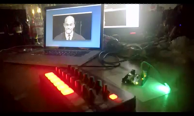

On Youtube: https://www.youtube.com/watch?v=z7nlPQQxJBw&

Tekno Blinkenlicht
==================

Result of Finnish Gamejam 2014 @ Assembly 2014 Summer.

License: BSDish. Use it, hack it, break it, what ever.

Novation Launch Control is a reg. trademark of Novation.
All rights relating to used Novation Launch Control image (edited image) is Novation's property, and no means to remove branding have
been used.

If you're not comfortable using Novation's images, feel free to replace images in assets/ directory, and replace the draw coordinates in
TeknoBlinkenlichtApp.cpp.

Image of Pertti "Spede" Pasanen is from Wikipedia, and thus is under permissive CC license.

Cinder is licensed under BSD.
RtMidi is licensed under BSD.

Requirements
------------

- A MIDI controller (e.g. Novation Launch Control); the game is configured to use Launch Control's default MIDI mapping
- An arduino, with an RGB-LED connected to pins 3, 5 & 6 (see arduino/Blinkenlich/Blinkenlicht.ino)
- Xcode or Visual Studio 2013
- Cinder 0.8.6dev (https://github.com/cinder/Cinder)
- Boost 1.55 (http://www.boost.org)

How to
------

- build Cinder
- make the connections and upload Arduino sketch to your board via Arduino IDE
- configure your Arduino port (ARDUINO_PORT) and MIDI controller name (MIDI_CONTROLLER_IN / MIDI_CONTROLLER_OUT) to TeknoBlinkenlichtApp.h
- build the project
- run the project and prepare to be trolled by Spede
